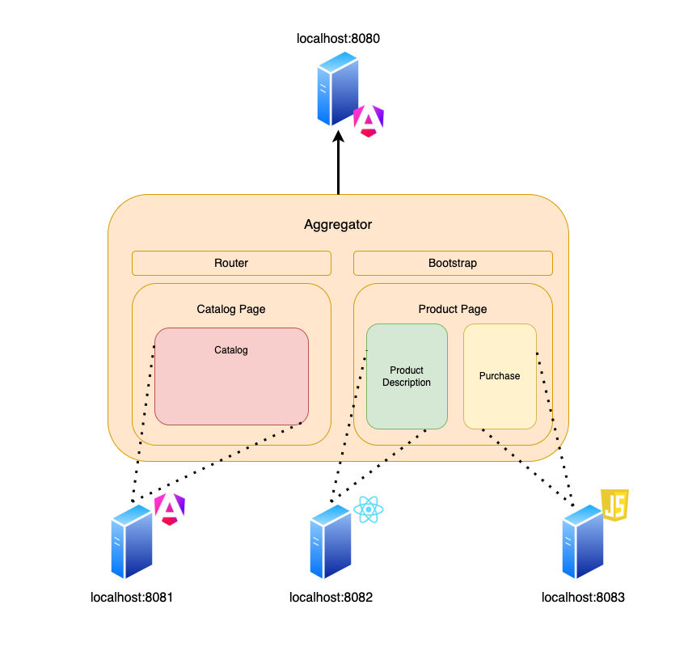

# Microfrontends Demo

This repository contains a demo of a microfrontends architecture using componentes built with different frameworks.

## Requirements

 * Docker
 * Node v18.20

## Architecture

The aggregator is an angular application that includes the other applications as web components. The other applications are built with different frameworks.

## Running the demo

This demo consists of 4 applications. You need to build each one of them and then run the docker-compose file.

* Go to aggregator and run `npm install` and `npm run build`
* Go to catalog and run `npm install` and `npm run build`
* Go to product and run `npm install` and `npm run build`
* Purchase is a simple js file, so no build is required

Then, from the root folder, run `docker compose up -d`

The main application will be available at `localhost:8080`

